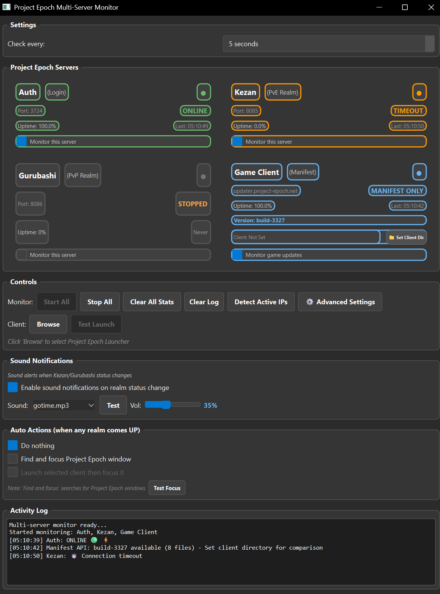

# Project Epoch Server Monitor



Monitors Project Epoch WoW server status with visual effects, notifications, and automatic client management.

## 🚀 Download & Install

### Easy Way (Recommended)
1. **[Download Latest Release](https://github.com/desuqcafe/Lazy-Project-Epoc-Monitor/releases/latest)**
2. **Extract the zip file**
3. **Run `ProjectEpochMonitor.exe`**

### Developer Way
```bash
git clone https://github.com/desuqcafe/Lazy-Project-Epoc-Monitor.git
cd repo
pip install -r requirements.txt
python EpochMonitor.py
```

## Features

### 📡 **Server Monitoring**
- Real-time status checking for `game.project-epoch.net:3724`
- Configurable check intervals (2-300 seconds)
- Uptime statistics and history tracking

### 🔔 **Smart Notifications**
- Desktop alerts when server comes online
- Custom notification sounds (supports MP3, WAV, OGG)
- System sound fallback when custom audio unavailable

### 🎮 **Client Management**
- Auto-launch WoW client when server comes UP
- Smart window detection and focusing
- Support for custom game executables
- Test buttons to verify setup

### ✨ **Enhanced Visuals** *(Optional)*
- Particle celebration effects when server comes online
- Dynamic gradient fills and glowing lines
- Pulse animations and sparkle trails
- Simulation mode to test effects

### ⚙️ **Convenience Features**
- Persistent settings (auto-saves preferences)
- Activity logging with timestamps
- Clear data management tools
- Dark theme UI

## Quick Start

1. **Launch the monitor**
2. **Set your WoW client path** (optional): Click "Browse" 
3. **Choose auto-action**: What to do when server comes UP
4. **Click "Start"** to begin monitoring

**Test everything works:**
- Click "Test" for notifications
- Click "Test Sound" for audio
- Click "Simulate UP" to see visual effects

## Requirements

**Minimum:** Windows 10+, Python 3.7+  
**Recommended:** All features work best with complete installation

**Dependencies automatically included in release version.**

## Purpose

Perfect for Project Epoch launch period - get notified the moment the server comes online and automatically bring your game to focus. No more constantly refreshing or checking manually!

---

*Probably only useful for a week or two during server launch! 😄*